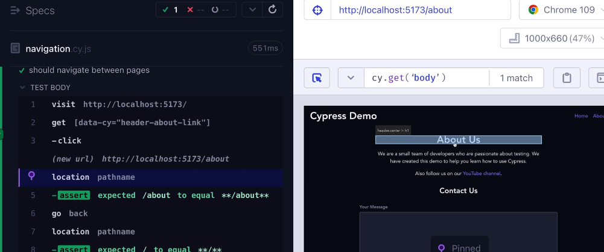
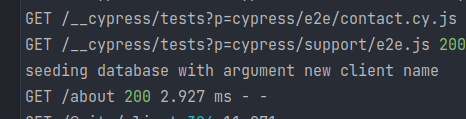
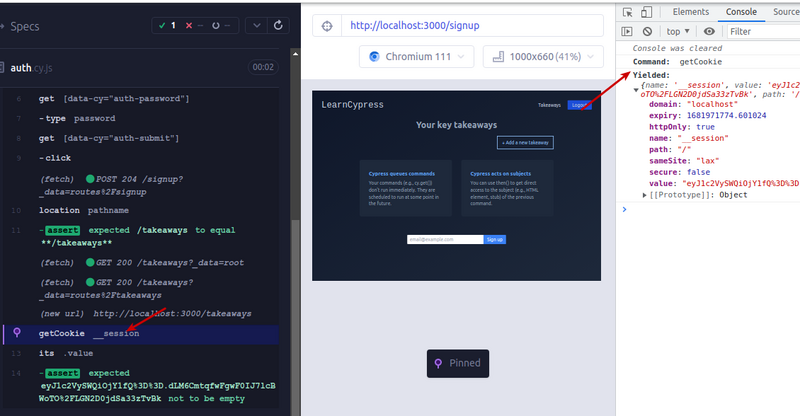

# Cypress end to end testing

Notes on the academind course of the same name

<!-- START doctoc -->
<!-- END doctoc -->

## What it is

End to end testing: Testing user interaction application workdflows of an application, e.g. login flow.

[Guides](https://docs.cypress.io/guides/overview/why-cypress)

[Cypress API](https://docs.cypress.io/api/commands/and)

## Installation

- `npm i cypress`
- `npx cypress open` opens a local cypress dashboard application where cypress can be configured and tests can be run
- tests can also be run on the command line with `npx cypress run` (or adding a `cypress run` script to package.json)
- It doesn't have to be installed in the project to be tested (but it might be useful if using types and functions of the project in the tests)

## Basics

All cypress commands are run *inside the browser* running the tests (as opposed to a node script that somehow remote-controls the browser).

### Implicit and explicit assersions

Many cypress tests have implicit expectations / assertions, e.g. that the selected element exists when selected with `cy.get`.

Cypress also use [`chai` assertions](https://docs.cypress.io/guides/references/assertions) that can be passed as the first argument to `cy.should`.

### Test isolation

Each test described with `it` runs in total isolation (cleared cookies etc.), so tests don't interfere with each other.

### get vs find

`get` is not chainable (even though it doesn't give an error)!

`cy.get('main').get('img')` is the same as `cy.get('img')` and finds the image *anywhere* on the page.

To chain queries, either use `cy.get('main').within($myMainSelector=>cy.get('img'))` or `cy.get('main').find('img')`.

`find` can only be chained to a `get` and not be used independently.

A first basic test

```javascript
describe('tasks page', () => {
  it('should render the main page', () => {
    // implicitly expects the page to render without giving a server error
    cy.visit('http://localhost:5173');
  });
  it('should render the logo', () => {
    cy.visit('http://localhost:5173');
    // implicitly expects the image to exist
    cy.get('.main-header img[src*="logo.png"]');
    // these tests do the same thing but with chained / scoped selectors
    cy.get('.main-header').within($myMain => {
      // only searches withing .main-header
      cy.get('img');
    });
    cy.get('.main-header').find('img');
  });
  it('should have one and only one h1 and it should have the correct text', ()=> {
    cy.visit('http://localhost:5173');
    // only one h1 should exist - explicit expectation / assertion
    cy.get('h1').should('have.length', 1);
    // contains can also be used without a previous selector, in which case
    // it tries to find the text in the whole page
    cy.get('header h1').contains('My Cypress Course Tasks');
  });
})
```

### `should` / `and`

`should` and `and` are used for explicit assertions. `should` and `and` are exactly the same method (`and` is an alias for `should`). They are solely aliases to make assertions read more like plain english.

They return a value that makes sense for the assertion, e.g. in `.should('have.attr', 'class').and('match', /invalid/)`.

Usually that is the original selector, but in some cases it is e.g. a string.

[should / and yields](https://docs.cypress.io/api/commands/and#Yields-Icon-namequestion-circle)

### User interaction

`cy.contains` looks for text and also yields the element like `get`, so these do the same in the 02_starting_project app:

```typescript
cy.contains('Add Task').click();
cy.get('button[data-cy="start-add-task-button"').click();
```

A first basic user interaction using clicks:

```javascript
describe('tasks management', ()=>{
    it('should  open and close the new task modal', ()=> {
        cy.visit('http://localhost:5173/');
        //cy.contains('Add Task').click(); // does the same, just selects by inner text
        cy.get('button[data-cy="start-add-task-button"').click();
        cy.get('#new-task-form');

        // test closing

        // this doesn't work as cypress, by default, clicks in the middle of the screen,
        // which is covered by the form popup
        // cy.get('.backdrop').click();

        // workaround 1: force click even if element is covered
        cy.get('.backdrop').click({
            force: true
        });

        // workaround 2: specify click position
        // cy.get('.backdrop').click("topLeft");

        // check if modal is closed now
        cy.get('.backdrop').should('not.exist') // the backdrop is the modals backdrop so it should be gone now, too
        cy.get('dialog.modal').should('not.exist')

        // check if it can be closed with the cancel button, too
        cy.get('button[data-cy="start-add-task-button"').click();

        // the button only exists if the modal is open, so we don't have to
        // check if the dialog is open
        cy.get('.actions button:first-child').click();
        cy.get('dialog.modal').should('not.exist')
    })
})
```

Basic tests with typing and selecting from dropdowns:

```javascript
describe('task creation', ()=> {
    it('should open the new task modal and create a task and save it', ()=> {
        cy.visit('http://localhost:5173/');
        cy.get('button[data-cy="start-add-task-button"').click();
        cy.get('#title').type('NEW_TASK_TITLE');
        cy.get('#summary').type('NEW_TASK_SUMMARY');
        cy.get('#category').select('moderate');

        cy.get('button[type="submit"]').click();
        cy.get('dialog.modal').should('not.exist')

        cy.get('li.task').should('have.length', 1);
        cy.get('.task h2').contains('NEW_TASK_TITLE');
        cy.get('.task p').contains('NEW_TASK_SUMMARY');
        cy.get('.task .task-category').contains('🔵');
    })
})
```

### Test setup for repeating tasks (test hooks)

Repetitive setups can be done in `beforeEach`:

`tasks_with_setup.cy.js`

```javascript
beforeEach(() => {
    cy.visit('http://localhost:5173/');
    //cy.contains('Add Task').click(); // does the same, just selects by inner text
    cy.get('button[data-cy="start-add-task-button"').click();
    cy.get('#new-task-form');
});

describe('task validation', () => {
    it('should not continue with nothing filled', () => {
        cy.get('button[type="submit"]').click();
        // contains can contain partial text
        cy.get('.error-message').contains('provide');
    });

    it('should not continue with just title filled', () => {
        cy.get('#title').type('NEW_TASK_TITLE');
        cy.get('button[type="submit"]').click();
        // contains can contain partial text
        cy.get('.error-message').contains('provide');
    });
    it('should not continue with just summary filled', () => {
        cy.get('#summary').type('NEW_TASK_SUMMARY');
        cy.get('button[type="submit"]').click();
        // contains can contain partial text
        cy.get('.error-message').contains('provide');
    });

    it('should continue without having to select a category as it is pre-filled', ()=> {
    cy.get('#title').type('NEW_TASK_TITLE');
    cy.get('#summary').type('NEW_TASK_SUMMARY');
    cy.get('button[type="submit"]').click();
    // contains can contain partial text
    cy.get('.error-message').should('not.exist')
});
})
```

Test hooks can also be added inside the test suite (inside `describe`).

More hooks:

```javascript
describe('contact form', () => {
  beforeEach(() => {
    cy.visit('http://localhost:5173/about');
    // cleanup, seed database etc.
  });

  // before runs only once before all tests.
  before(() => {});

  afterEach(() => {
    // it is NOT recommended to do cleanup work in after hooks;
    // instead, do it in beforeEach / before
  });

  after(() => {});
```

### Checking for element order

```javascript
// select index 0 of the list returned by get
cy.get('li.task').eq(0).contains('TASK1');
cy.get('li.task').eq(1).contains('TASK2');

// same thing (if there are 2 tasks)
cy.get('li.task').first().contains('TASK1');
cy.get('li.task').last().contains('TASK2');
```

## Element selection, assertions and more

### Selecting elements -  best practices

The recommended way for selecting elements is to add `data-cy` (or similar) data attributes that need to be selected in the app and select them using these, e.g. `cy.get('[data-cy="header-about-link"]');`.
This ensures that changing ids, class names and positions don't cause the tests to fail or need to be changed as well.

To check how to best select an element (besides using the browsers developer tools), the cypress runner app itself can be used:



### Testing navigation

```javascript
it('should navigate between pages', ()=> {
    cy.visit('http://localhost:5173');
    // recommended selection by data-cy attribute
    cy.get('[data-cy="header-about-link"]').click();
    // check URL
    cy.location('pathname').should('equal', '/about');
    // just make sure the page in the url actually matches what we expect
    cy.get('[data-cy="about-header"');
    // test back button
    cy.go('back');
    cy.location('pathname').should('equal', '/');

    // check "Home" link on about page
    cy.get('[data-cy="header-about-link"]').click();
    cy.get('[data-cy="header-home-link"]').click();
    cy.location('pathname').should('equal', '/');
})
```

### Chaining commands

Commands can be chained. The next command works on the element yielded by the last command, which is usually the same as the lat get command in the chain.

Mostly a stylistic choice.

```typescript
    it('should submit the form', ()=> {
        cy.visit('http://localhost:5173/about');
        cy.get('[data-cy="contact-input-message"]').type('MESSAGE');
        cy.get('[data-cy="contact-input-name"]').type('NAME');
        cy.get('[data-cy="contact-input-email"]').type('EMAIL@example.com');
        cy.get('[data-cy="contact-btn-submit').click();
        cy.get('[data-cy="contact-btn-submit').contains('Sending');
        cy.get('[data-cy="contact-btn-submit').should('be.disabled');
        // same
        cy.get('[data-cy="contact-btn-submit').should('have.attr', 'disabled');

    })

    it('should validate the form', ()=> {
        cy.visit('http://localhost:5173/about');
        // it may be more readable as it clearly shows only once which the
        // following commands are operating on
        cy.get('[data-cy="contact-btn-submit')
            .click()
            .contains('Send Message')
            .should('not.have.attr', 'disabled');
    })
```

### Values and aliases

The way cypress works is reading the test source and building a chain of commands that should be performed, so the `cy.get` command doesn't contain the actual element but the *command* to select an element.

Assigning a `cy.get` to a variable works in some instances but is not recommended.

Rather use `as` if necessary:

```javascript
// works but not recommended
const submitBtn = cy.get('[data-cy="contact-btn-submit');
submitBtn.click();

// recommended way (if reusing a "selector" at all)
cy.get('[data-cy="contact-btn-submit').as('submitBtn');
cy.get('@submitBtn').contains('Sending');
cy.get('@submitBtn').should('be.disabled');
```

### More direct element access with `then()`

`.then` gets a function as an argument which argument contains a wrapper for the element(s) selected by the previous selector. This element is similar to a DOM element selected by `getElementById` (but not the same).

The default object for `.visit` is the window object. More on this in the [stubs section](#stubs).

Normal cypress methods can also be called inside the `.then` block / callback. e.g. `cy.stub`.

Inside the function, we can use `expect` for assertions (as the argument / element / subject of the callback function is not a cypress object but a DOM element, so `el.should(...)` wouldn't work).

```javascript
cy.get('[data-cy="contact-btn-submit').then((el)=> {
    expect(el.attr('disabled')).to.be.undefined;
    expect(el.text()).to.eq('Send Message');
});
```

Directly accessing objects using `el[0]`, `el[1]` etc. gives more direct access for the DOM elements.

```javascript
cy.get('[data-cy="contact-input-message"]').then(el=> {
    el[0].focus();
    el[0].blur();
    expect(el.attr('class')).to.contains('invalid')
});
```


We can blur elements with standard cypress methods too, so we wouldn't need to use `el[0]` if we wanted to check for that.

Using `then` can lead to problems in headless mode.

### Simulating special key presses

Special keys such as enter can be encoded in `type` as well:

```javascript
cy.get('[data-cy="contact-input-email"]').type('EMAIL@example.com{enter}');
```

[Special keys codes for type in cypress](https://docs.cypress.io/api/commands/type)

### Assertion time frame

The default timeframe that cypress uses to check if an assertion is true is **4 seconds**. This can be problematic if we e.g. check the text of a submit button, which changes from "Send Message" to "Sending..." and then back to "Send Message". In that case, assertions for both texts would be true.

Use negative assertions in that case, e.g.

```javascript
cy.visit('http://localhost:5173/about');
cy.get('[data-cy="contact-btn-submit').click();
cy.get('[data-cy="contact-btn-submit').then(el=>{
    expect(el).to.not.have.attr('disabled');
    expect(el).to.not.equal('sending');
});
```

### Losing / gaining focus (blur / focus)

```javascript
cy.visit('http://localhost:5173/about');
cy.get('[data-cy="contact-input-message"]').as('msgInput');
cy.get('@msgInput').focus();
cy.get('@msgInput').blur();
cy.get('@msgInput')
    .parent()
    .then(el => {
        expect(el.attr('class')).to.contains('invalid');
    });
// chaining focus and blur
cy.get('[data-cy="contact-input-name"]')
    .focus()
    .blur()
    .parent()
    .then(el => {
        expect(el.attr('class')).to.contains('invalid');
    });
```

### Running tests without using cypress studio

`npx cypress run` executes the tests in a headless mode without cypress studio. This also automatically creates videos and screenshots of failing tests in `./cypress/videos` and of the whole test runs (failing or not) in `./cypress/videos`.

Problem: since the headless browser is running faster, there can be timing and compatibility problems as the headless browser can be an older version, and also runs the tests faster and doesn't necessary wait for the page to reach a certain status.

Possible solutions:

- use a `data-cy` attribute on the elements to be checked instead of using `parent` and other relative selectors.
- avoid `.then` and rather use `.should`

```javascript
// can lead to problems in headless / command line mode
cy.get('[data-cy="contact-input-name"]')
    .focus()
    .blur()
    .parent()
    .then(el => {
        expect(el.attr('class')).to.contains('invalid');
    });

// better
cy.get('[data-cy="contact-input-name"]')
    .focus()
    .blur()
    .parent()
    .should('have.attr', 'class').and('match', /invalid/);
```

`should` can also be used in the exact same way as `then` but works differently under the hood, so it should keep the tests from failing:

```javascript
// can fail
cy.get('@msgInput')
    .parent()
    .then(el => {
        expect(el.attr('class')).to.contains('invalid');
    });

// doesn't fail
cy.get('@msgInput')
    .parent()
    .should(el => {
        expect(el.attr('class')).to.contains('invalid');
    });
```

### Taking screenshots explicitely 

Screenshots can be explicitely taken (even if the test succeeds) using `cy.screenshot();`.

## Configuration and customization

[Cypress can be configured in `cypress.config.js`](https://docs.cypress.io/guides/references/configuration).

Settings can also be set in the tests themselves instead of changing the global config by passing a configuration object as a second argument to `describe` or, on test level, to `it`:

```javascript
describe('contact form', {
  defaultCommandTimeout: 6000,
}, () => {
  it('should submit the form', {
    defaultCommandTimeout: 8000,
  }, () => {
    cy.visit('http://localhost:5173/about');
    // ...
```


### Timeouts

Cypress by default checks for 4 seconds before it regards a test as failed (e.g. it waits for an element to appear).

There are different [`*Timeout` settings](https://docs.cypress.io/guides/references/configuration#Timeouts) that can be set in the config, e.g. `defaultCommandTimeout` for the timeout of basic DOM based commands.
Other timeouts such as `pageLoadTimeout` already have higher default timeouts.

### Setting the test browser

The browser to execute the tests can be set using 

```javascript

describe('contact form', {
    browser: 'firefox',
}, () => {
    // ...
```

or by passing the browser in the command line:

`npx cypress open --browser firefox`


### Configuring the baseURL

The baseURL can be set inside the e2e property of the config object and is usually done in the project config.

```javascript
export default defineConfig({
  e2e: {
    baseUrl: 'http://localhost:5173',
    setupNodeEvents(on, config) {
      // implement node event listeners here
    },
  },
});
```

and then only use the relative URLs in the tests.

```javascript
// ..
cy.visit('/');
cy.get('[data-cy="header-about-link"]').click();
// ...
```

### Custom commands and queries

- Commands: Re-usable shortcuts for more complex command chains (e.g. submitForm() to find the submit button and clicks it)
- Queries: Synchronous, chainable, retriable commands, e.g. getById('abc') as a custom query that finds elements with `data-cy="abc"`

Too many custom commands and queries should be avoided as it makes the tests less readable. Only use it for complex, often repeated steps and name it well.

#### Custom commands

[Custom commands](https://on.cypress.io/custom-commands) can be defined in `cypress/support/commands.js`.


Custom command example

```javascript
Cypress.Commands.add('submitForm', ()=> {
    cy.get('form button[type="submit"]').click();
})
```

This command is now availabe in the test suit as `cy.submitForm();` (no autocompletion though)

#### Custom queries

Custom queries are created in the same `commands.js` file as custom commands.

Create using `Cypress.Commands.addQuery`. The function in the callback must return a function. This function can be re-tried by cypress like the built-in methods.

```javascript
// the parameter goes into the callback, not in the returned function!
Cypress.Commands.addQuery('getById', (cyAttribute) => {
    // prepare custom query ofr future execution
    const getFn = cy.now('get', `[data-cy="${cyAttribute}"]`);
    return () => {
        // runs when the query is actually run in the test
        return getFn();
    }
});
```

Usage is the same as for commands, e.g. `cy.getById('contact-input-message')`; it is chainable like other cypress queries / commands, depending on what the function called by `cy.now` returns normally.
`cy.now` is only to be used in custom queries.

### Understanding tasks / trigger node functions in tests

`cy.task` allows to run nodejs code *outside* of the browser in tests or hooks.

Event listeners that run on specific cypress commands such as `task` can be defined in `cypress.config.js` inside `e2e`.

```javascript
import { defineConfig } from "cypress";

export default defineConfig({
    e2e: {
        baseUrl: 'http://localhost:5173',
        setupNodeEvents(on, config) {
            // implement node event listeners here
            on('task', ({
                // define functions to be run outside here
                seedDatabase(someValue) {
                    // run node js code, e.g. clean up and seed the test database,
                    // delete and re-create a test client in directus using the CLI etc.
                    console.log(`seeding database with argument ${someValue}`);

                    // the method must return a value, null or a promise that resolves to a value or null
                    // the return value can be accessed with .then in the tests
                    return null;
                }
            }));
        },
    },
});
```

Run with `cy.task('seedDatabase')` in the cypress tests / hooks and access the returned value with `.then` if necessary.

```javascript
before(() => {
    cy.task('seedDatabase', 'new client name').then(val => {...});
  });
```

In the terminal running cypress, you can see that the function is run in node:



## Stubs, Spies, Fixtures, Clock

### Stubs

Problem: when the tests need user interaction with the browser application (not the page itself), e.g. allowing access to the user`s location, the tests can't run automatically.

Stubs are a replacement for an existing function / methods that simulate the output of that method.

#### Empty stubs

In the example, the position gets fetched using the built in `window.navigator.geolocation.getCurrentPosition` method. We *don't* test the correct function of that browser method as that's not in the scope of testing our UI but is done / guaranteed by the browser vendor.

As the cypress script is run *before* the actual tests start and just defines what to do *when* the tests start, we don't have direct access to the `window` object at that point, except when using `.then`, which defers execution in the passed-in callback to while it's actually running the tests.

```javascript
describe('share location', () => {
    it('should fetch the user location', () => {
        cy.visit('/').then(win=>{
            // replaces window.navigator.geolocation() method with an empty method
            // during runtime
            cy.stub(win.navigator.geolocation, 'getCurrentPosition')
                .as('getUserPosition'); // assign alias
        });
        cy.get('[data-cy="get-loc-btn"]').click();
        // aliases defined inside then are still available outside of it!
        cy.get('@getUserPosition').should('have.been.called');

        // check if button is disabled after click
        cy.get('[data-cy="get-loc-btn"]').should('be.disabled');

        // fails because getCurrentPosition is just an empty function so far which doesn't do anything
        cy.get('[data-cy="actions"]').should('contain', 'Location fetched');
    });
});
```

#### Fake stub implementation

Several methods can be chained to `cy.stub` such as `resolves`, `returns`, `callsFake` (which fakes the stubbed function and is useful if the stubbed function takes a callback as an argument and doesn't return / resolve anything by itself).

```javascript
describe('share location', () => {
  it('should fetch the user location', () => {
    cy.visit('/').then(win=>{
      // replaces window.navigator.geolocation() method with an empty method
      // during runtime
      cy.stub(win.navigator.geolocation, 'getCurrentPosition')
          .as('getUserPosition') // assign alias
          .callsFake((callBack)=>{
            // if we immediately execute the callBack, the button will never
            // be disabled in the UI as it happens too fast so the DOM will never
            // go to the disabled state (as it's so fast it will happen between
            // render frames)
            // Solution: simulate execution time by using a setTimeout
            setTimeout(()=>{
              const fakePositionObject = {
                coords: {
                  latitude: 37.5,
                  longitude: 48.01,
                }
              }
              // calls the passed in callback with the expected object
              callBack(fakePositionObject);
            }, 100);

          })
    });
    cy.get('[data-cy="get-loc-btn"]').click();
    // aliases defined inside then are still available outside of it!
    cy.get('@getUserPosition').should('have.been.called');

    // check if button is disabled after click
    cy.get('[data-cy="get-loc-btn"]').should('be.disabled');

    // fails because getCurrentPosition is just an empty function so far which doesn't do anything
    cy.get('[data-cy="actions"]').should('contain', 'Location fetched');
  });
});
```

#### Stubs with arguments, return values and using stubs across tests

```javascript
// create stubs before each test
beforeEach('share location', () => {
    cy.visit('/').then(win => {
        cy.stub(win.navigator.geolocation, 'getCurrentPosition')
            .as('getUserPosition') // assign alias
            .callsFake((callBack) => {
                setTimeout(() => {
                    const fakePositionObject = {
                        coords: {
                            latitude: 37.5,
                            longitude: 48.01,
                        }
                    };
                    callBack(fakePositionObject);
                }, 100);

            });

        // stub with empty function that returns a promise that resolves immediately
        cy.stub(win.navigator.clipboard, 'writeText').as('saveToClipboard').resolves();
    });
});

describe('share location', () => {
    it('should fetch the user location', () => {
        // ...
    });

    it('should copy the location to the clipboard', () => {
        cy.get('[data-cy="name-input"]').type("John Doe");
        cy.get('[data-cy="get-loc-btn"]').click();
        cy.get('[data-cy="share-loc-btn"]').click();
        cy.get('@saveToClipboard').should('have.been.called');
        // check if it is called with a correct argument
        cy.get('@saveToClipboard').should('have.been.calledWithMatch', 
            new RegExp(`.*${37.5}.*${48.01}.*${encodeURI('John Doe')}`));
    });
});
```

### Using fixtures

In the above example, we hardcoded name and position data and had to copy it to multiple places in the tests.

We could have defined normal JS variables at the top of the file, e.g. `const name='John Doe';`, but then these could have been used only in the current file.

Fixtures are just "fixed dummy data" that can be created in `/cypress/fixtures`, typically as a json file.

The data can then be used by assigning it an alias and wrapping the code that uses the fixture in a callback.

Example:

`cypress/fixtures/user-location.json`

```json
{
  "coords": {
    "latitude": 37.5,
    "longitude": 48.01
  }
}
```

`location.cy.js` (the test file)

```javascript

// ...
// usage in the beforeEach hook
cy.fixture('user-location.json').as('userLocation');
cy.visit('/').then(win => {
    cy.get('@userLocation').then(fakePosition => {
        cy.stub(win.navigator.geolocation, 'getCurrentPosition')
            .as('getUserPosition') // assign alias
            .callsFake((callBack) => {
                setTimeout(() => {
                    callBack(fakePosition);
                }, 100);
            });
    })
});
// ...
// usage in the test
    cy.get('@userLocation').then(fakePosition=>{
        const {latitude, longitude} = fakePosition.coords;
        cy.get('@saveToClipboard').should('have.been.calledWithMatch',
            new RegExp(`.*${latitude}.*${longitude}.*${encodeURI('John Doe')}`));
    })
```

### Spies

Spies are *listeners* that can be attached to a function / method similar to stubs that doesn't change the function but evaluates function calls and the passed in parameters.

```javascript
// set up spies
cy.spy(win.localStorage, 'setItem').as('storeLocation');
cy.spy(win.localStorage, 'getItem').as('getLocation');

// ...

cy.get('@userLocation').then(fakePosition=>{
    const {latitude, longitude} = fakePosition.coords;
    // ...
    cy.get('@storeLocation').should('have.been.called');
    cy.get('@storeLocation').should('have.been.calledWithMatch', 
        /John Doe/, // check first argument of setItem 
        new RegExp(`.*${latitude}.*${longitude}.*${encodeURI('John Doe')}`) // second argument
    );
    cy.get('@getLocation').should('have.been.called');

});
```

### Timers / manipulating the clock
```javascript
beforeEach('share location', () => {
    // make clock / tick available in tests
    cy.clock(); // must be called before initializing the tests
});

// in the test:
cy.tick(2000); // forward the clock by 2 seconds
// would also work without setting the timer in this case as cypress waits / retries
// for up to 4 seconds for the test to pass, and the message disappears after 2 seconds
cy.get('[data-cy="info-message"]').should('not.be.visible');
```

## Network requests, DBs and authentication

The test DB should be set via `.env` files, e.g. `.env.test`. For directus, that would be an additional `.env.test` beside `.env.local`, `.env.dev` etc.

A test database should be seeded before every test. As the cypress tests run in the browser, they must be set up on the backend in `cypress.config.js` to be used later in `beforeEach`:

`cypress.config.js`:

```javascript
import { defineConfig } from 'cypress';

import { seed } from './prisma/seed-test';

export default defineConfig({
  e2e: {
    baseUrl: 'http://localhost:3000',
    setupNodeEvents(on, config) {
      // implement node event listeners here
      on('task', {
        async seedDatabase() {
          await seed();
          return null;
        }
      })
    },
  },
});
```

`sometest.cy.js`:

```javascript
// ...
describe('Takeaways', () => {
    beforeEach(() => {
        cy.task('seedDatabase');
    });
    // ...
});
```

### Using interceptors

Problem: if we use the DB / API for a frontend test, the tests take longer to complete due to the network request, even if we just want to test a frontend feature (e.g. if a certain text is displayed after a successful data load).

Interceptors can be used to intercept and simulate http requests.

Interceptors are typically set up before `cy.visit` or in beforeEach as it's a setup for the actual test(s).

Interceptors can be used to set up a spy for the request that don't replace it but give a handle to check e.g. if the request was sent or not:

`cy.intercept('POST', '/newsletter*').as('theRequest');`

To *block* the request and let it return dummy data, we can simply add an object that contains the desired response:

`cy.intercept('POST', '/newsletter*', {status: 201})` would always immediately return status 201 for the intercepted requests.

```javascript
describe('Newsletter', () => {
    // ...
    it('should sign a user up to the newsletter via the sign up form', () => {
        // typically set up before cy.visit or in beforeEach as it's a setup for the actual test
        // intercepts any HTTP POST request to localhost:3000/newsletter... (* is a wildcard)
        cy.intercept('POST',
            '/newsletter*', {status: 201}) // the base api path is already set up in the cypress config file
            .as('subscribe'); // optionally set up an alias

        cy.visit('/');
        cy.get('[data-cy="newsletter-email"]').type('test99@example.com');
        cy.get('[data-cy="newsletter-submit"]').click();
        cy.wait('@subscribe'); // wait for the intercepted request to finish - usually not necessary
        cy.get('[data-cy="newsletter-email"]').should('not.exist');
        cy.get('footer').should('contain.text', 'Thanks for signing');

    });

    it('should display validation errors', ()=> {
        cy.intercept('POST', '/newsletter*', {message: 'Email exists already'}).as('subscribe');

        cy.visit('/');
        cy.get('[data-cy="newsletter-email"]').type('test2@example.com');
        cy.get('[data-cy="newsletter-submit"]').click();
        cy.get('[data-cy="newsletter-email"]').should('exist');
        cy.get('footer').should('contain.text', 'exists already');
    })
});
```

**Gotcha**: in combined SSR / CSR frameworks such as nextjs and remix, some requests are done on the server and can't be intercepted (such as reading a takeaways in the example project, which is done server side and rendered with the retrieved data to the client)

### Testing APIs with test requests

The requests are tested already if we seed the DB and do our tests without intercepting the requests.

For decoupling tests, it might be reasonable to test the API directly using `cy.request`.

```javascript
it('should successfully create a new contact', ()=> {
      cy.request({
          method: 'POST',
          url: '/newsletter',
          body: {email: 'test@example.com'},
          form: true // if formdata is sent, for just JSON data not necessary
      }).then(res => {
          expect(res.status).to.equal(201);
      })
    });
```

### Testing authentication flows and asserting cookie values

Side note: when opening the dev tools in the browser that runs the tests, clicking on a step in the test runner shows what it yields and other information.



Testing the signup flow:

```javascript
describe('Auth', ()=>{
    beforeEach(() => {
        cy.task('seedDatabase');
    });
    it('should sign up a user', ()=>{
        cy.visit('/signup');
        cy.get('[data-cy="auth-email"]').click();
        cy.get('[data-cy="auth-email"]').type("test2@example.com");
        cy.get('[data-cy="auth-password"]').type("password");
        cy.get('[data-cy="auth-submit"]').click();

        // 2 indicators that the signup process has succeeded for this application:
        // - url should contain /takeaways
        cy.location('pathname').should("eq", '/takeaways')

        // - session cookie should exist
        cy.getCookie('__session')
            .its('value') // Get a property's value on the previously yielded subject. https://docs.cypress.io/api/commands/its
            .should('not.be.empty');
    });

    // previous user can't be used as the db is reseeded before every test
    // cookies are automatically cleared by cypress
    it('should login', ()=>{
        cy.visit('/login');
        cy.get('[data-cy="auth-email"]').click();
        cy.get('[data-cy="auth-email"]').type("test@example.com");
        cy.get('[data-cy="auth-password"]').type("testpassword");
        cy.get('[data-cy="auth-submit"]').click();
        cy.location('pathname').should("eq", '/takeaways')
        // same as when signing up
        cy.getCookie('__session')
            .its('value')
            .should('not.be.empty');
        
        cy.contains('Logout').click();
        cy.location('pathname').should("eq", '/')
        cy.getCookie('__session').its('value').should('be.empty');
    })
})
```

### Creating a reusable login command

`cypress/support/commands.js`:

```javascript
Cypress.Commands.add('login', ()=> {
  cy.visit('/login');
  cy.get('[data-cy="auth-email"]').click();
  cy.get('[data-cy="auth-email"]').type("test@example.com");
  cy.get('[data-cy="auth-password"]').type("testpassword");
  cy.get('[data-cy="auth-submit"]').click();
  cy.location('pathname').should("eq", '/takeaways')
  cy.getCookie('__session')
      .its('value')
      .should('not.be.empty');
})
```

... can be called now in any test using `cy.login();`:

```javascript
it('should login', ()=>{
        cy.login();
    })

it('should logout', ()=>{
    cy.login();
    cy.contains('Logout').click();
    cy.location('pathname').should("eq", '/')
    cy.getCookie('__session').its('value').should('be.empty');
})
```

### Accessing interceptor request and response data

```javascript
it('should create a new takeaway', () => {
    // block request and stub response
    cy.intercept('POST',
        '/takeaways/new*',
        'success') // the response can be anything we like, e.g. a string we can test easily
        .as('createTakeaway'); // needed later
    cy.login();
    cy.visit('/takeaways/new');
    cy.get('[data-cy="title"]').click();
    cy.get('[data-cy="title"]').type('TestTitle1');
    cy.get('[data-cy="body"]').type('TestBody1');
    cy.get('[data-cy="create-takeaway"]').click();
    cy.wait('@createTakeaway') // wait is needed so we can look at what's posted
        .its('request.body') //
        .should('match', /.*TestTitle.*TestBody1/)
});
```

## Other links

[adding tests to gitlab](https://medium.com/devops-with-valentine/run-your-cypress-e2e-tests-in-gitlab-ci-complete-guide-909990962001)

https://github.com/cypress-io/cypress-realworld-app
